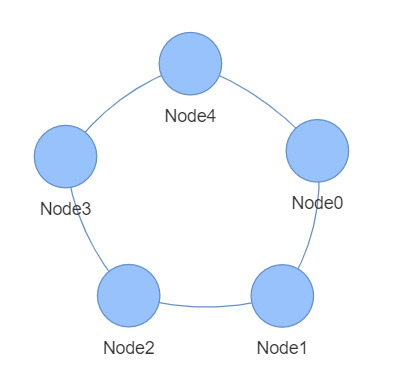
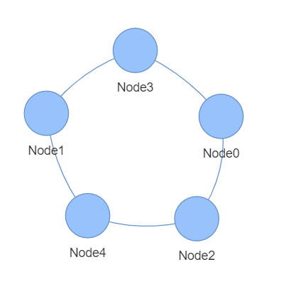

# Checking isomorphism of graphs with python

This project has been created for **Discrete Mathematics 1** and is meant to check isomorphism of two simple, non-directional graphs. Graphs can be entered either manually or with properly formatted text file. Default graphs are provided for basic functionalities, there is also a data.txt file provided, which contains example of a properly formatted input file contents.

## Quick Start

First you need to clone this repository and install dependencies (this guide assumes you have python3 already installed, if that is not the case, check [this](https://www.python.org/downloads/) out):

```
git clone https://github.com/mvishiu11/graphs_isomorphism.git
cd graphs_isomorphism
pip install -r requirements.txt  # install dependencies
```

Then, all you need to do is use the provided script:

```
cd src
python check_isomorphism.py --input_type default
```

The code above uses default graphs, provided with the implementation.

## Using your own graphs

You can use your own, custom graphs, by specifying them with one of the provided methods:

- Specify edges one by one in the terminal:
```
python check_isomorphism.py --input_type edges
```
- Use a properly formatted text file (expected formatting is explained in *help* section, and also can be found in data.txt file provided) contaning a list of edges or adjacency matrices of the desired graphs:
```
python check_isomoprhism.py --input_type from_file --input_file <file_path>
```
- You can also check *help* section for more info:
```
python check_isomorphism.py --help
```

## Visualization

Your graphs can be visualized using PyVis. All you need to do (assuming you already installed dependencies using provided requirements.txt file) is add `--visualize` flag:

```
python check_isomorphism.py --input_type default --visualize
```

The visualizations of your graphs will be saved in the base dircetory as *html* files with interactive graphs in them. Thanks to visualization it is easy to confirm whether the provided test works correctly. 

### Example usage - default graphs

On default scripts checks two graphs: 

**G<sub>1</sub>, for which E<sub>1</sub> = [(0, 1), (0, 4), (1, 2), (2, 3), (3, 4)]** <br>
**G<sub>2</sub>, for which E<sub>1</sub> = [(0, 2), (0, 3), (1, 3), (1, 4), (2, 4)]**

If we run the script using `python check_isomorphism --visualize` we get:

```
Using default graphs:
                Graph 1:  [(0, 1), (0, 4), (1, 2), (2, 3), (3, 4)]
                Graph 2:  [(0, 2), (0, 3), (1, 3), (1, 4), (2, 4)]

Those graphs are isomorphic: True!
```

And we can easily check if that's true, because we used `--visualize` flag. If we open the visualization we see something like this:




So as we can see, those graphs are clearly isomorphic, thus making the scripts prediction correct!


